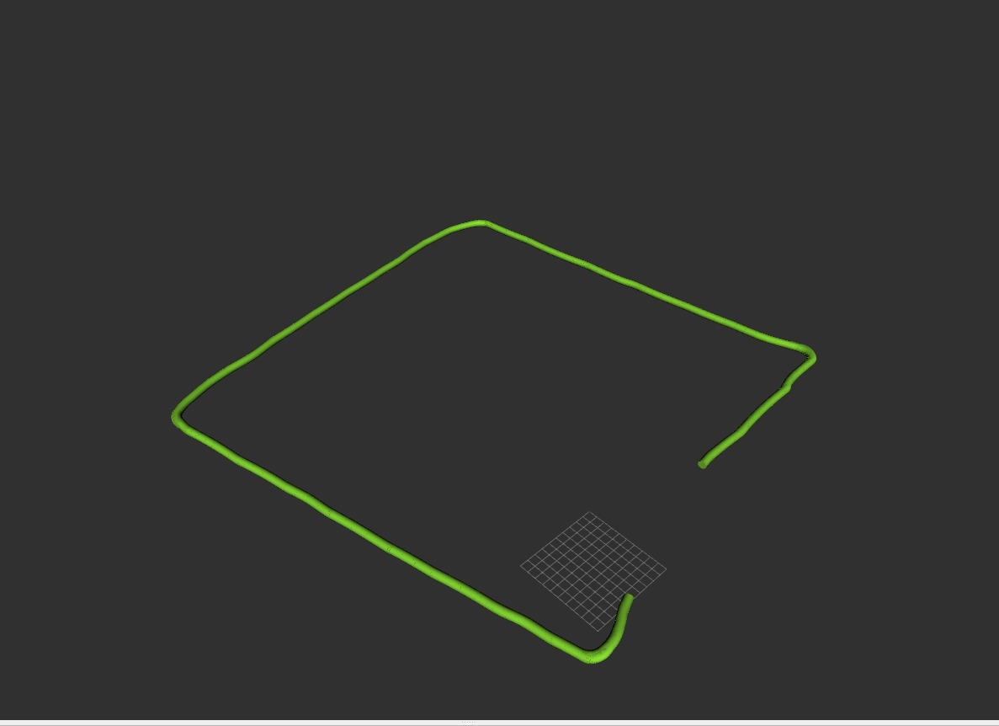

# Odometry Assignment

This project is part of my contributions to the ITU Rover team. In this assignment, the goal was to estimate the motion of a planetary rover using only wheel speeds and IMU data.

## 🛠️ What This Project Does

- The provided `rosbag` file includes wheel speed feedback and IMU data from a test run conducted at the Faculty of Electrical and Electronics Engineering.
- Using known wheel radius and speed data, the task is to estimate how far the rover has moved from its starting position (odometry).
- The rover should trace a square path based on this odometry data.

## 📁 Files

- `odometry_assignment.py`: Python script for calculating odometry.
- `odometry.jpeg`: A reference image showing the expected square path that the rover should draw.

## 🖼️ Expected Result

Below is the expected square trajectory of the rover:

## 🚀 How to Run

1. Make sure you have the necessary ROS tools and Python dependencies installed.
2. Play the provided `rosbag` file.
3. Run the `odometry_assignment.py` script to calculate and visualize the rover's trajectory.

Feel free to explore the code and let me know if you have any questions!
