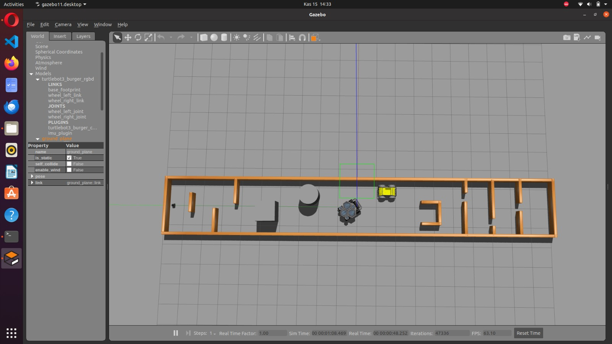

## ITU Rover Movement Task

First task of Istanbul Technical University Rover team.In this task, we were supposed to write a python code to move Turtlebot3 robot in a Gazebo simulation via pynput library and we were also supposed to show required logs on terminal by using rospy library during 60 seconds.

